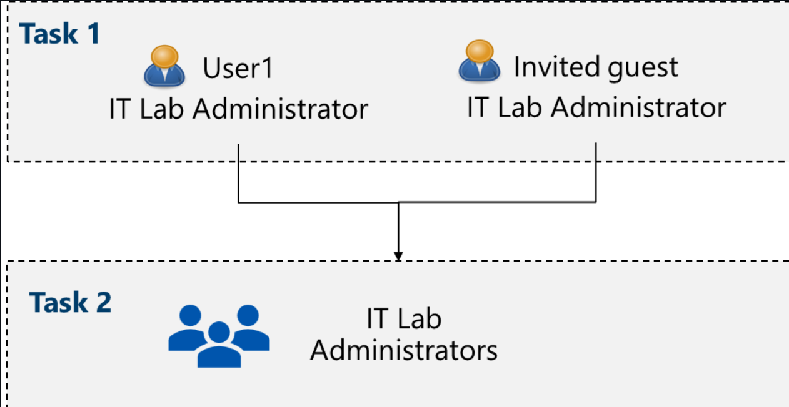
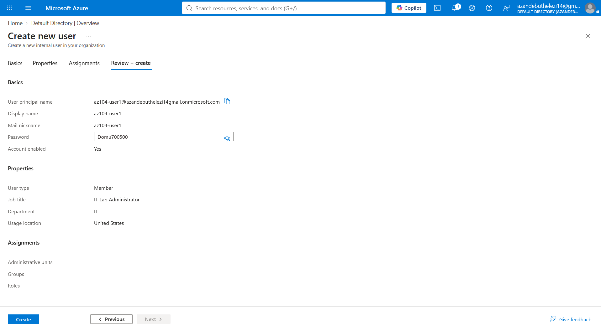
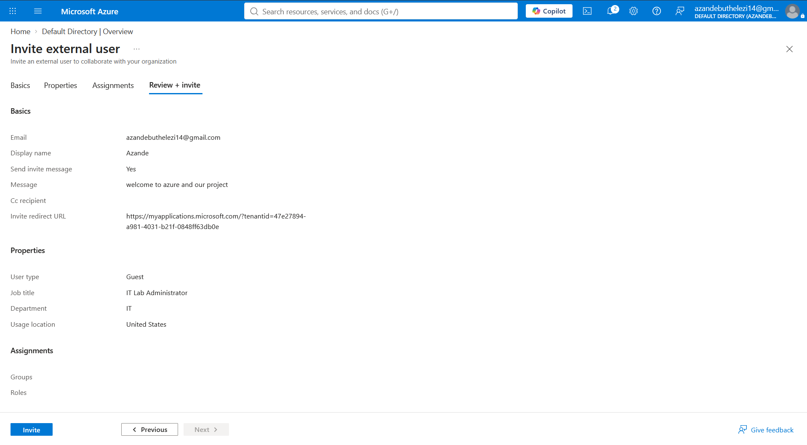
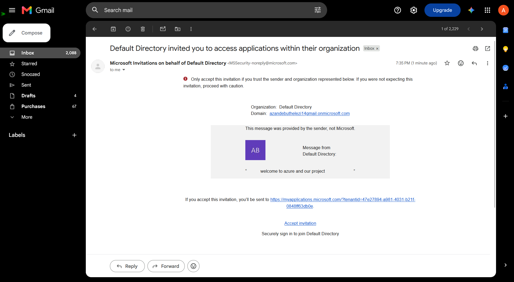
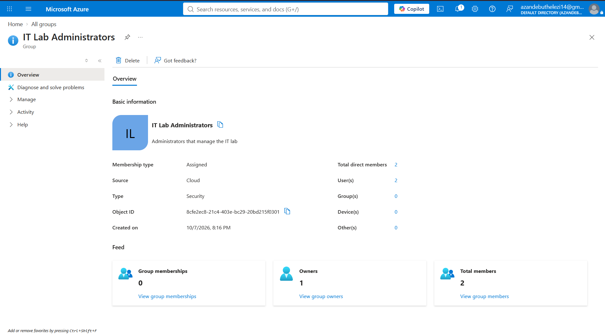

# AZ-104 — Microsoft Entra ID Identity Administration

## Overview

This project documents a practical Microsoft Azure lab focused on
administering identities and groups using Microsoft Entra ID.

The lab demonstrates user provisioning, external guest identities,
security group administration, group ownership, and group membership.

## Scenario

An organization is building a pre-production environment for testing
applications and services.

Several engineers require access to manage the lab environment.
Microsoft Entra ID is used to manage their identities and organize
them into appropriate security groups.

## Objectives

- Create and configure a Microsoft Entra ID user
- Configure user identity properties
- Create an external guest user
- Create a security group
- Configure group ownership
- Add users to the security group
- Understand assigned and dynamic group membership

## Technologies

Potential extensions to this project include:

- Automating user creation with PowerShell
- Automating group creation with Azure CLI
- Implementing dynamic groups
- Implementing Azure RBAC
- Exploring additional Microsoft Entra security controls

## Architecture

## Implementation

### 1. Microsoft Entra ID

I accessed Microsoft Entra ID through the Azure portal and reviewed
the tenant configuration.

**Result:** Microsoft Entra ID was successfully accessed and used as
the identity management platform for the lab.

---

### 2. Create an Internal User

Created the `az104-user1` account.

The account was configured with:

| Property | Value |
|---|---|
| Username | `az104-user1` |
| Job Title | `IT Lab Administrator` |
| Department | `IT` |
| Account | Enabled |
| Usage Location | United States |

**Result:** The internal user was successfully created and configured.

---

### 3. Create an External Guest User

Created an external guest user and sent an invitation to the user's
email address.

The guest account was configured with the appropriate job title,
department and usage location.

**Result:** The external guest identity was successfully created.

---

### 4. Create the Security Group

Created the following security group:

**IT Lab Administrators**

Configuration:

| Property | Value |
|---|---|
| Group Type | Security |
| Group Name | IT Lab Administrators |
| Membership Type | Assigned |

**Result:** The `IT Lab Administrators` security group was successfully
created.

---

### 5. Configure Group Ownership

Configured myself as an owner of the `IT Lab Administrators` group.

**Result:** Group ownership was successfully configured.

---

### 6. Add Group Members

Added the following users to the security group:

- `az104-user1`
- External guest user

**Result:** Both users were successfully added to the
`IT Lab Administrators` security group.

---

## Security Considerations

This lab demonstrates several important identity and access management
concepts.

- Group-based access management
- Principle of least privilege
- External guest identity management
- Separation of administrative responsibilities
- Identity-based access control

In a production environment, guest access and administrative
permissions should be regularly reviewed.

## Assigned vs Dynamic Group Membership

### Assigned Membership

Users are manually added or removed from the group.

### Dynamic Membership

Group membership can be automatically determined using user or device
attributes.

Dynamic membership can reduce administrative overhead in larger
environments.

## What I Learned

This lab improved my understanding of Microsoft Entra ID and how cloud
identities can be organized and managed using users and security groups.

I also learned how assigned and dynamic group membership can be used
to support different identity-management requirements.

## Skills Demonstrated

- Microsoft Entra ID administration
- User provisioning
- Guest user management
- Security group administration
- Group ownership
- Group membership management
- Azure Portal administration
- Identity and Access Management

## Future Improvements

Potential extensions to this project include:

- Automating user creation with PowerShell
- Automating group creation with Azure CLI
- Implementing dynamic groups
- Implementing Azure RBAC
- Exploring additional Microsoft Entra security controls

## Lab Evidence

Screenshots included in this repository provide evidence of the
completed configuration.

**Certification Track:** Microsoft AZ-104 — Azure Administrator  
**Focus Area:** Identity and Access Management
